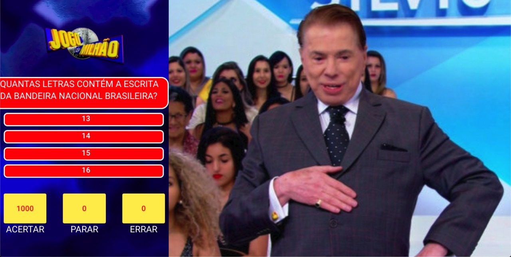
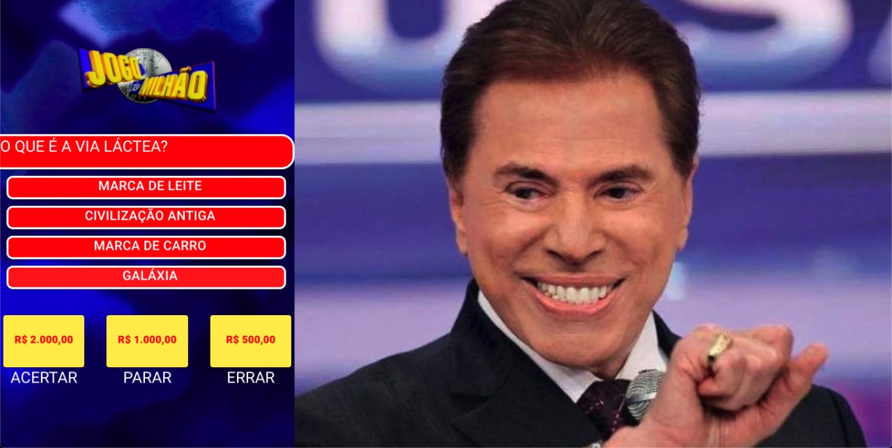
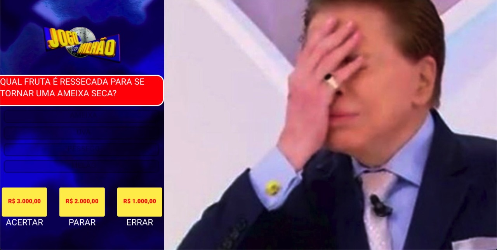
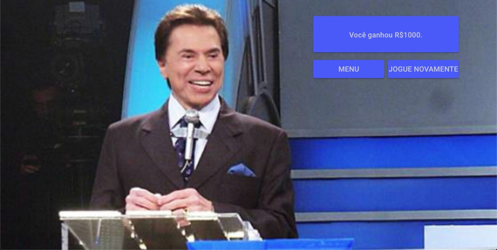

# Show do Milhão

## Como jogar

### Ao entrar no game, você entrará no menu, onde pode clicar no botão Play para tentar ganhar um milhão de reais em barras de ouro.

### Depois disso o Silvio irá aguardar até que você responda a primeira pergunta.

### Caso os astros se alinhem e você consiga acertar, o Silvio vai ficar muito contente e te dirá a próxima pergunta.
#### Além disso você tem a opção de parar a qualquer momento.

### Caso não seja o seu dia de sorte e você erre, Silvio vai ficar decepcionado com você, e te redirecionará para a tela de score.

### Na tela de Score, seja por erro ou por parada, você poderá visualizar quanto você conseguiu ganhar. Nela você também pode selecionar se gostaria de tentar novamente, ou deseja voltar para a tela de Menu.

### Se você chegou nessa tela, PARABEEENS, você agora possui 1 Milhão de reais em barras de ouro (mas só na imaginação ok?).

